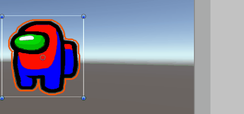

>  实现类似amongus里面角色太空人 红蓝部分变色的功能，现有实现思路：1 找到需要变色的部分 2 上色。


## 实现思路

最简单的方案就是让美术抠出一个遮罩texture，分别用两个通道保存需要变色的区。

在本需求中可以不使用额外贴图，用本身贴图自带的R和B通道即可。

核心代码：

```
    fixed rValue = col.r-col.b-col.g;//为了避免头盔部分会受到影响，做了个处理
    fixed bValue = col.b-col.r-col.g;
   
     rValue = saturate(rValue);
     bValue = saturate(bValue);
            
     col.rgb = lerp(col.rgb, _PassRColor.rgb, rValue);//上色
     col.rgb = lerp(col.rgb, _PassBColor.rgb, bValue);
```


lerp(a, b, f)：计算(1−f)∗a+b∗f或者a+f∗(b−a)的值。





* [完整代码](https://github.com/boomxiao/RegionColorChange/)


