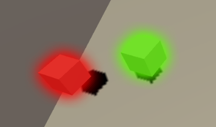

>   需要实现一个多个物体发光的功能，且需要自由更改物体的发光颜色。最终效果:



[完整代码](https://github.com/boomxiao/Bloom/)

# 实现思路

Bloom效果大体分为三步：1 单独渲染发光物体到一张RT上；2 模糊RT ；3 在 OnRenderImage 中 混合。

要实现不同物体发出不同颜色的光，最直接的办法就是用CommandBuffer直接渲染。

技术要点：*1 需要让发光效果有正确的遮挡关系，需要使用深度图                 来处理遮挡问题*   

*2 需要使用模板测试来区分发光物体和光晕*


# 开发笔记


项目中使用了四个着色器,Opaque 用来渲染发光物体，Blur用来模糊图像，Cut用来设置发光物体部分的Alpha,Composite 用来最后的混合。


获取深度贴图

```
MainCamera.depthTextureMode |= DepthTextureMode.Depth;
```

渲染

```
 private void Draw() {
        RenderBuffer.Clear();
        RenderBuffer.SetRenderTarget(BloomBufferID);
        RenderBuffer.ClearRenderTarget(true, true, Color.clear);

        for(int i = 0; i < this.BloomRenders.Count; i++) { //逐个渲染发光物体
            RenderBuffer.SetGlobalColor(PropertyID.ColorID, this.BloomRenders[i].Color);
            RenderBuffer.DrawRenderer(this.BloomRenders[i].Renderer,OpaqueRenderMaterial);
        }

        RenderTextureDescriptor tempDesc = BloomBufferDescriptor;
        tempDesc.width = BloomBuffer.width ;
        tempDesc.height = BloomBuffer.height;
        tempDesc.depthBufferBits = 0;
        tempDesc.width = BloomBuffer.width / DownsampleFactor;//采样系数
        tempDesc.height = BloomBuffer.height / DownsampleFactor;

        RenderBuffer.GetTemporaryRT(PropertyID.Blur1ID, tempDesc, FilterMode.Bilinear);
        RenderBuffer.GetTemporaryRT(PropertyID.Blur2ID, tempDesc, FilterMode.Bilinear);

        ///模糊开始
        RenderBuffer.Blit(BloomBufferID, Blur1ID);
        bool oddEven = true;
        for(int i = 0; i < Iterations; i++) {
            float off = BlurMinSpread + BlurSpread * i;
            RenderBuffer.SetGlobalFloat(PropertyID.BlurOffset, off);

            if(oddEven) {
                RenderBuffer.Blit(Blur1ID, Blur2ID, BlurMaterial);
            } else {
                RenderBuffer.Blit(Blur2ID, Blur1ID, BlurMaterial);
            }
            oddEven = !oddEven;
        }
        ///模糊结束
        RenderBuffer.Blit(oddEven ? Blur1ID : Blur2ID, BloomBufferID, CutMaterial);//扣出发光区域

        RenderBuffer.ReleaseTemporaryRT(PropertyID.Blur1ID);
        RenderBuffer.ReleaseTemporaryRT(PropertyID.Blur2ID);
    }
```

混合

```
   private void OnRenderImage(RenderTexture source, RenderTexture destination) {
        Graphics.Blit(source,destination,CompositeMaterial);//混合
    }
```

