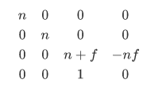

  在近平面n和远平面f的之间的任意点P(x,y,z,1) 在经过透视投影矩阵变化之后，其深度是如何变化的？

# 推导

 透视投影矩阵M=

[矩阵推导](https://www.bilibili.com/video/BV1X7411F744?p=4/)

已知0<n<z<f.

P点再投影变化之后的P'=(xn,yn,(n+f)*z-n\*f,z),

P'在透视除法变换到NDC空间之后，z'=n+f-n*f/z.

```
z'-z=n+f-n*f/z-z
    =(n+f)*z/z-n*f/z-z*z
分母z>0
分子=(n+f)*z-n*f-z*z
    =n*z+f*z-n*f-z*z
    =z*(n-z)+f*(z-n)
    =z*(n-z)-f*(n-z)
    =(z-f)(n-z)
z<f and n<z  可得 分子>0,即：z'-z>0

```

# 结论

近平面n和远平面f的之间的点在经过透视变换之后的深度值变大了（更靠近远平面了).

这也解释了为什么透视投影变换之后(还要经过透视除法)的NDC空间内的深度值不是线性的（f(z)=n+f-n*f/z），所以在着色器中通常采样完深度贴图之后需要将深度转换到线性空间下。