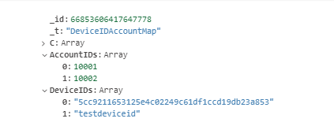

#  工作环境

数据库版本：MongoDB 5.06

开发环境：C# ，.netCore2.2


# 问题分析

客户端根据手机的设备号请求用户数据，首先要通过设备号查询到用户ID，设备号一般是字母数字混合的字符串，数据库通过字符查询的速度是O(n)（即遍历整个数据库），且字符串之间的比较对性能消耗也比较大。测试结果：在27w数据的时候查询一次的耗时约140ms。


# 优化思路

直接按照字符串查找用户ID的时间复杂度太高，优化思路是获取字符串的HashCode,以HashCode为主键缓存设备码和用户ID，这样时间复杂度就来到了O(logn)且避免了字符串之间的比较。


# 优化过程

刚开始准备使用c#内置的GetHashCode ，它返回一个32位的整形，但是该方法只能保证在同一个进程的内存空间中其HashCode是唯一的,它无法保证每次计算同一坨字符串得到的值是固定。

所以需要手撸一个可靠的GetHashCode的方法：

```c#
 public static long GetInt64HashCode(string strText) {
            long hashCode = 0;
            if (!string.IsNullOrEmpty(strText)) {
                byte[] byteContents = Encoding.Unicode.GetBytes(strText);
                System.Security.Cryptography.SHA256 hash =
                new System.Security.Cryptography.SHA256CryptoServiceProvider();
                byte[] hashText = hash.ComputeHash(byteContents);
                long hashCodeStart = BitConverter.ToInt64(hashText, 0);
                long hashCodeMedium = BitConverter.ToInt64(hashText, 8);
                long hashCodeMedium1 = BitConverter.ToInt64(hashText, 16);
                long hashCodeEnd = BitConverter.ToInt64(hashText, 24);
                hashCode = hashCodeStart ^ hashCodeMedium^ hashCodeMedium1 ^ hashCodeEnd;
            }
            return (hashCode);
        }
```

 sha256一个信息摘要算法，与Md5相似，该方法返回的是32个字节的byte数组。

将byte数组拆分成四个长整型然后返回他们的异或结果。

因为返回的值只有8个字节，远小于sha256返回的精度，所以该算法发生碰撞的概率也远大于sha256算法的碰撞概率。

为了避免哈希冲突的问题，这里采用一对多的数据结构：（_id是设备id的HashCode，AccountdIDs和DeviceIDs俩数组分别保存用户ID以及设备码）



在收到客户端的请求之后，服务器计算出客户端传来的设备码的HashCode,根据HashCodo可能查询到多个设备码和用户ID,然后判断设备码的一致性即可正确找到用户ID（没查到就是没注册用户）。


# 优化结果

修改算法后在同样的测试环境下耗时在6ms左右。